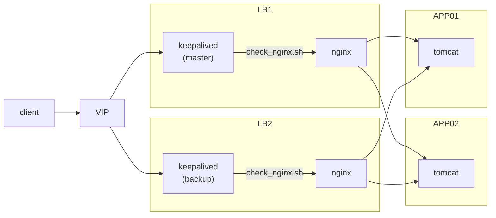
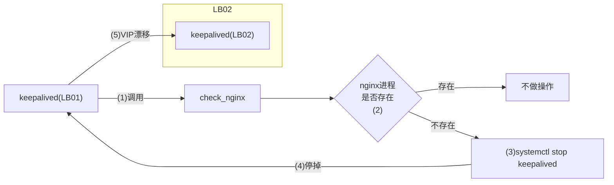

| IP              | name  | software         | comment                                 |
| --------------- | ----- | ---------------- | --------------------------------------- |
| 192.168.122.10  | LB1   | keepalived+nginx | nginx配置的代理端口8080                 |
| 192.168.122.11  | LB2   | keepalived+nginx | nginx配置的代理端口8080                 |
| 192.168.122.12  | APP01 | tomcat           | 端口8080                                |
| 192.168.122.13  | APP02 | tomcat           | 端口8080                                |
| 192.168.122.100 | VIP   |                  | keepalived进行维护，决定VIP是否需要漂移 |

## 1 安装配置nginx

### 1.1 安装(LB1+LB2)

```shell
dnf install nginx
```

### 1.2 配置(LB1+LB2)

```
#vim /etc/nginx/nginx.conf
```

在配置文件/etc/nginx/nginx.conf中增加代码段部分：

events {
    worker_connections 1024;
}

```
#stream是配置代理
stream {
  #配置日志
  log_format main '$remote_addr $upstream_addr - [$time_local] $status $upstream_bytes_sent';
  access_log /var/log/nginx/tomcat-access.log main;
  
  #upstream是配置负载均衡，支持5种分配方式：轮询backend(默认),weight,ip_hash,fair,url_hash
  #for tomcat
  upstream tomcat {
	server 192.168.122.12:8080;  #APP01上部署的tomcat
	server 192.168.122.13:8080;  #APP02上部署的tomcat
  }
  #nginx使用8080端口来代理upstream中配置的tomcat
  server {
  	listen 8080;
	proxy_pass tomcat;
  }
}
```

验证配置是否正常

```
#nginx -t
```

### 1.3 启动nginx

```
#systemctl start nginx
```

### 1.4 编写检查nginx进程是否存在

```
#vim /etc/nginx/check_nginx.sh
count=$(ps -ef |grep nginx |egrep -cv "grep|$$")
if [ "$count" -eq 0 ];then
   systemctl stop keepalived
fi
```

```
#chmod u+x /etc/nginx/check_nginx.sh
```

## 2 安装配置keepalived

### 2.1 安装(LB1+LB2)

```
dnf install keepalived
```

### 2.2 配置(LB1)

```
#vim /etc/keepalived/keepalived.conf
```

```
#注释以下这条，否则无法ping通虚拟ip地址
#vrrp_strict

#增加vrrp_script，定义vrrp的脚本check_nginx
vrrp_script check_nginx {
  script "/etc/nginx/check_nginx.sh"
}

#修改vrrp_instance中注释的部分
vrrp_instance VI_1 {
    state MASTER    #LB1为MASTER LB2为BACKUP
    interface ens3  #网卡名
    virtual_router_id 51
    priority 100    #优先级，MASTER为100, BACKUP为90
    advert_int 1
    authentication {
        auth_type PASS
        auth_pass 1111
    }
    virtual_ipaddress {  
        192.168.122.100  #配置虚拟IP
    }
    track_script {   #跟踪脚本，会调用此脚本
      check_nginx
    }
}

```

### 2.3 配置(LB2)

```
#vim /etc/keepalived/keepalived.conf
```

```
#注释以下这条，否则无法ping通虚拟ip地址
#vrrp_strict

#增加vrrp_script，定义vrrp的脚本check_nginx
vrrp_script check_nginx {
  script "/etc/nginx/check_nginx.sh"
}

#修改vrrp_instance中注释的部分
vrrp_instance VI_1 {
    state BACKUP    #LB1为MASTER LB2为BACKUP
    interface ens3  #网卡名
    virtual_router_id 51
    priority 90   #优先级，MASTER为100, BACKUP为90
    advert_int 1
    authentication {
        auth_type PASS
        auth_pass 1111
    }
    virtual_ipaddress {  
        192.168.122.100  #配置虚拟IP
    }
    track_script {   #跟踪脚本，会调用此脚本
      check_nginx
    }
}
```

### 2.4 启动

```
#systemctl start keepalived
```

### 2.5 检查

#### 2.5.1 在LB01上查看VIP是否存在

```
#ip a
```

```
1: lo: <LOOPBACK,UP,LOWER_UP> mtu 65536 qdisc noqueue state UNKNOWN group default qlen 1000
    link/loopback 00:00:00:00:00:00 brd 00:00:00:00:00:00
    inet 127.0.0.1/8 scope host lo
       valid_lft forever preferred_lft forever
    inet6 ::1/128 scope host 
       valid_lft forever preferred_lft forever
2: ens3: <BROADCAST,MULTICAST,UP,LOWER_UP> mtu 1500 qdisc fq_codel state UP group default qlen 1000
    link/ether 52:54:00:69:f7:87 brd ff:ff:ff:ff:ff:ff
    inet 192.168.122.10/24 brd 192.168.122.255 scope global noprefixroute ens3
       valid_lft forever preferred_lft forever
    inet 192.168.122.100/32 scope global ens3
       valid_lft forever preferred_lft forever
    inet6 fe80::e227:b11b:fe3:8d20/64 scope link dadfailed tentative noprefixroute 
       valid_lft forever preferred_lft forever
    inet6 fe80::7196:9ba5:b2de:c492/64 scope link dadfailed tentative noprefixroute 
       valid_lft forever preferred_lft forever
    inet6 fe80::6bf5:be52:b953:26ab/64 scope link dadfailed tentative noprefixroute 
       valid_lft forever preferred_lft forever

```

#### 2.5.2 停止LB01上的nginx,查看VIP 是否会转移到LB02

 在LB01上

```
#systemctl stop nginx
```



#### 2.5.3 查看nginx日志

在浏览器中访问tomcat

http://192.168.122.100:8080

查看/var/log/nginx/tomcat-access.log日志，查看访问的记录,在APP01和APP02上轮询

```
192.168.122.1 192.168.122.12:8080 -[13/Aug/2020:15:27:36 +0800] 200 0
192.168.122.1 192.168.122.13:8080 -[13/Aug/2020:15:27:36 +0800] 200 0
192.168.122.1 192.168.122.12:8080 -[13/Aug/2020:15:27:36 +0800] 200 0
192.168.122.1 192.168.122.13:8080 -[13/Aug/2020:15:27:36 +0800] 200 0
192.168.122.1 192.168.122.13:8080 -[13/Aug/2020:15:27:46 +0800] 200 384
192.168.122.1 192.168.122.12:8080 -[13/Aug/2020:15:27:53 +0800] 200 729
192.168.122.1 192.168.122.13:8080 -[13/Aug/2020:15:27:53 +0800] 200 0
```

### 3 理解

1、keepalived的功能是实现两台主机通过vip去实现访问变换的无缝切换，两台主机通过vip实现HA;

2、keepalived要与nginx部署在一起，通用keepalived的vip来实现部署在两台服务器上nginx的HA;

3、当一台主机上的nginx出现故障进程丢失(check_nginx实现)，则会将这台主机的keepalived进程停掉，则vip漂移到另一台keepalived上;

4、nginx作为tomcat的代理，实现了两台应用(tomcat)的不同访问策略，也实现了tomcat的HA;

5、当一台tomcat出现故障，则nginx不会再访问故障的tomcat

### 4 关于脚本check_nginx

check_nginx只是用来监控nginx进程，

可以根据io、cpu、mem等条件去杀掉keepalived，实现vip漂移;

### 5 关于keepalived

想要实现vip漂移，只需要杀掉一下keepalived即可

可以根据任意信息，来判断是否需要vip飘逸;

比如如果数据库是HA的，则可以根据数据库的负荷，来实现将访问切换到另一台数据库上。